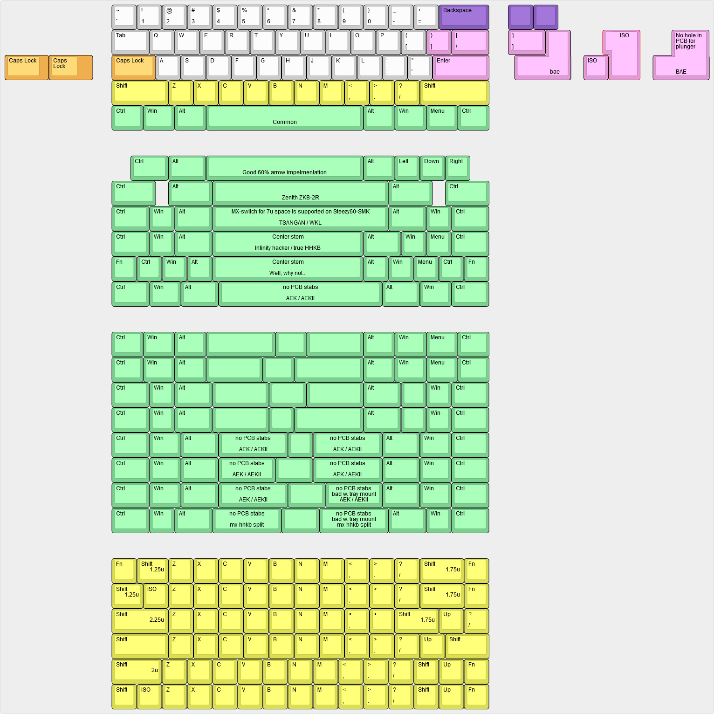
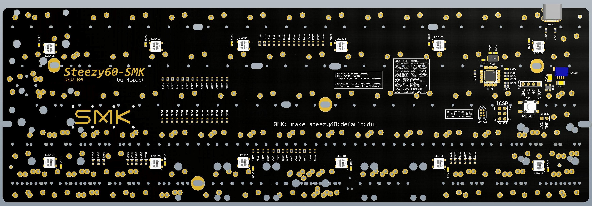

# Steezy60-SMK

Steezy60-SMK is a 60% PCB for SMK gen 2 switches, compatible with standard tray-mount cases. The goal is to bring modern layout options to some great vintage switches.

## Some features:
- Extensive layout support
- QMK
- USB C
- RGB underglow
- Cherry PCB-stab support for most layout options
- Support for some of the weird Alps switch positions for compatibility with SMK Alps mount switches and classic Alps keysets (not for cherry stem SMK switches).
- Support for MX-mount switch on 6.25u and 7u spacebar position, this to enable use of silenced MX-switch on large spacebars. (no onion chopping spacebar sound)

## Layout support - Rev B: 

## Altium view of PCB

## Revisions:
- Rev A1: Initial prototype, issues: had 2 alps footprints left over from other pcb.
- Rev B1: Changed processor to atmega32u2, changed layout support, removed some mounting holes (for chinese cases).