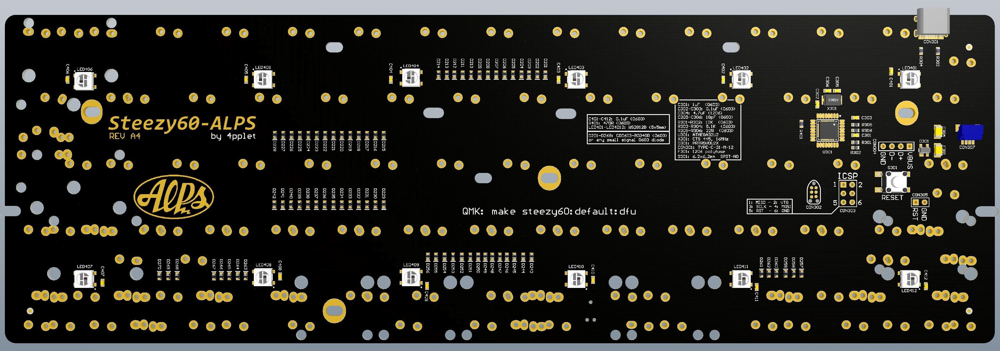

# Steezy60

Steezy60 is a 60% PCB in two versions: one for SMK gen 2 switches one for ALPS-compatible switches. Compatible with standard tray-mount cases. The goal is to bring modern layout options to some great vintage switches.

## Some features:
- Extensive layout support
- QMK
- USB C
- RGB underglow
- Cherry PCB-stab support for most layout options
- JST-connector for daughter board

# SMK:
- Support for MX-mount switch on 6.25u and 7u spacebar position, this to enable use of silenced MX-switch on large spacebars. (no onion chopping spacebar sound)
- Support for some of the weird Alps switch positions for compatibility with SMK Alps mount switches and classic Alps keysets (not for cherry stem SMK switches).

## Altium view of ALPS PCB

## Altium view of SMK PCB

## Layout support - Rev B: 

## Revisions:

# ALPS 
- Rev A1: Initial prototype, issues: had 2 alps footprints left over from other pcb.
- Rev B1: Changed processor to atmega32u2, changed layout support, removed some mounting holes (for chinese cases).

# SMK
- Rev A1: Initial prototype based on SMK-version.