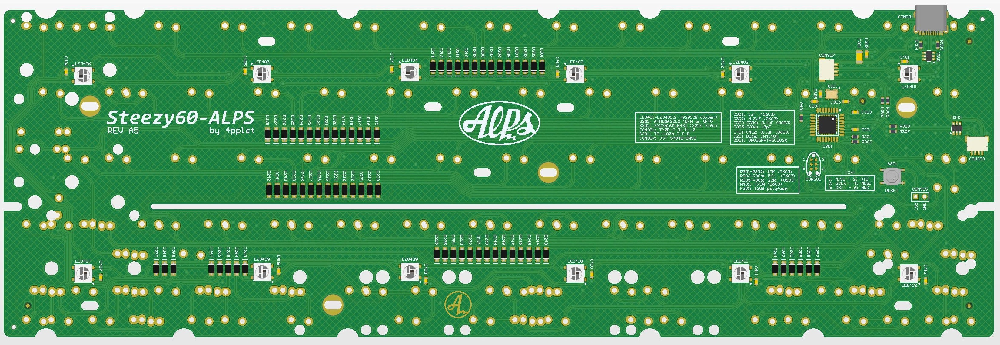
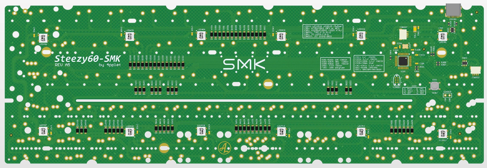
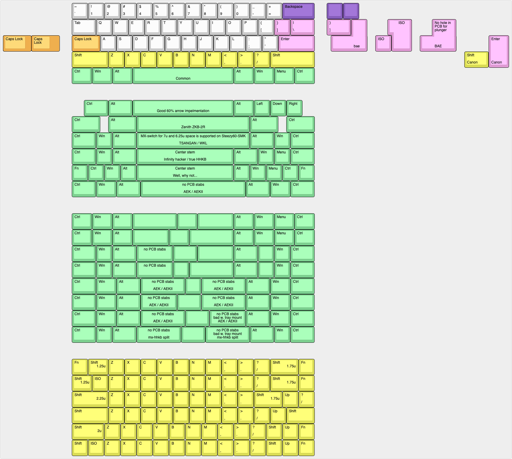

# Steezy60

Steezy60 is a 60% PCB in two versions: one for SMK gen 2 switches one for ALPS-compatible switches. Compatible with standard tray-mount cases.

## Some features:
- Extensive layout support
- QMK
- Simple VIA support (just common layout options)
- USB C
- RGB underglow
- Cherry PCB-stab support for most layout options
- USB horizontal placement is classic GH60, same as GH60, plain60, voyager60 etc.
- JST-connector for daughter board (two different positions, one for bakeneko, one for cases compatible with wilba PCB.)

### SMK:
- Support for MX-mount switch on 6.25u and 7u spacebar position, this to enable use of silenced MX-switch on large spacebars. (no onion chopping spacebar sound)
- Support for some of the weird Alps switch positions for compatibility with SMK Alps mount switches and classic Alps keysets (not for cherry stem SMK switches).

## Altium view of ALPS PCB

## Altium view of SMK PCB

## Layout support:

## Revisions:

### SMK 
- Rev A1: Initial prototype, issues: had 2 alps footprints left over from other pcb.
- Rev B1: Changed processor to atmega32u2, changed layout support, removed some mounting holes (for chinese cases).
- Rev A2: Rotated left shift stabilizer for better universal plate support, reset revision designator to A (old A-revision does not exist anymore), to match Steezy60-Alps. Removed PCB name and logo on top, removed flash command from silk.
- Rev A3: Added support for Canon Spherical Keycaps, improved routing, added support for rubber-band mouting.
- Rev A4: Moved daughter board connector to allign with other projects.
- Rev A5: Moved daughter board a bit to fit better in bakeneko cases, Added cutout for bakeneko V3 (untested), Added assembly option for PCB to fit in wilba cases (untested).

### ALPS
- Rev A1: Initial prototype based on SMK-version.
- Rev A2: Rotated left shift stabilizer for better universal plate support, removed PCB name and logo on top, removed flash command from silk.
- Rev A3: Added support for Canon Spherical Keycaps, improved routing, added support for rubber-band mouting.
- Rev A4: Moved daughter board connector to allign with other projects.
- Rev A5: Moved daughter board a bit to fit better in bakeneko cases, Added cutout for bakeneko V3 (untested), Added assembly option for PCB to fit in wilba cases (untested).
